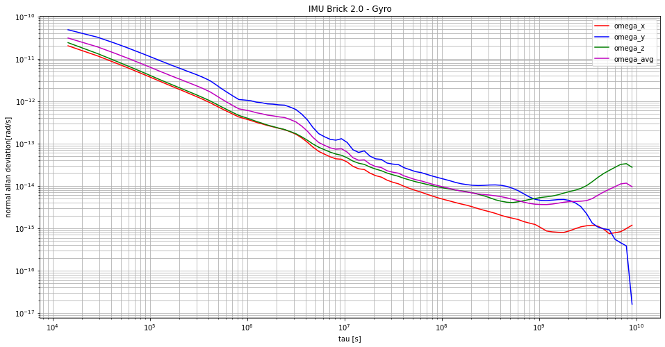

## Allan Variance

To match with Kalibr requirement, we also need to determine the error model of the IMU we're using. It exist a lot of different process to determine noise density, and random walk, but allan variance is one of this tools that is commonly used. 
Basically it has so many works done about it, and so it is well documented. 
To process Allan Variance, you either have the choice to run it on MATLAB, or using python Jupyter Notebook (Anaconda) 

**Hardware :** TinkerForge - IMU Bricks 2.0

**Process :**

1) Create your data set. So you will need the IMU you want to test, and some time. To record a proper data set, just let your IMU in a place that is very stable, and record your data as a csv 
   Below, an example of how csv header should look like (colomns does not matter that much, you just have to change the value of each in the code).

===================================================

"timestamp","omega_x",...,"omega_z",...,"alpha_z"
	
*Warning* : Even people walking around, or small vibrations can disturb recording, so be carefull where you set your experience
Also, make sure to disable any data fusion or calibration algorithm that could "fake" your data set.
For duration of experience, 4h was the least to see random walk, and for the following example sample rate was 200Hz.

2) Either use [Matlab Allan Variance Kalibr](https://github.com/rpng/kalibr_allan), or Python one that is free access, and require less time to process.

For *MATLAB*, you can follow hyper link to have more information, about allan variance and processing step, or basically you just have to run the code **Va_with_matlab**, it will return a file that you have to run with **Result_processing** and you will be returned some graphs for the gyrometers and accelerometers.
For *Python*, just open **Allan_Variance.ipynb** with Jupyter Notebook.

### Example Plot - IMU Bricks 2.0 _ MATLAB

   
### Example Plot - IMU Bricks 2.0 _ Python

